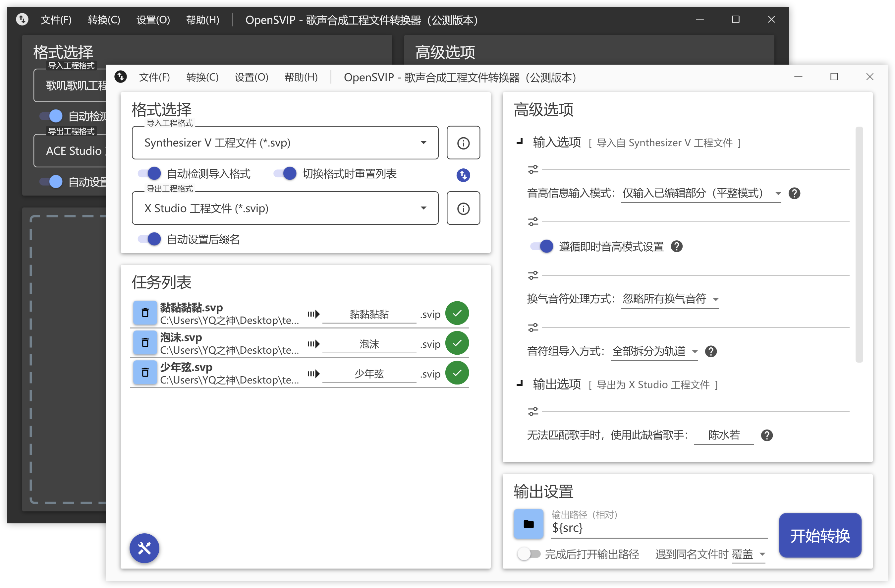
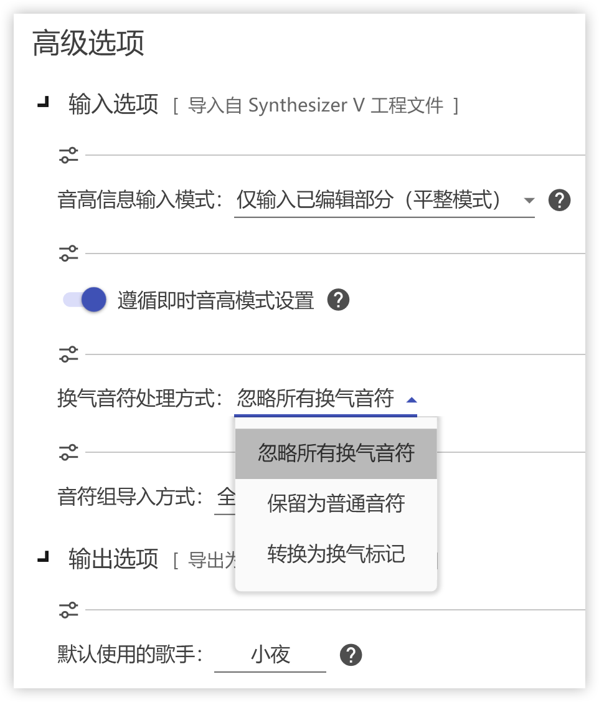

# OpenVPI Homepage
简单易用、高度灵活、功能强大的歌声合成工程文件格式转换器已开启公测：[B站专栏](https://www.bilibili.com/read/cv16468227)

## 面向未来的歌声合成工程文件转换器

在我们的理念中，所有人都应享有选择的权利和自由。因此，我们致力于为您带来第二次机会，使您的创作免受平台的制约与圈子的束缚。借助我们的转换器，您将能够在各类歌声合成平台的工程文件格式之间自由切换。

通过我们精心设计的应用程序，您只需指定输入与输出格式、批量导入文件、选择输出路径，即可开启转换任务。 

    
     
    <a style="color:orange; display: inline-block; color: #999; padding: 2px;">
        基于 Material Design 构建的用户界面，简洁美观，响应流畅
    </a>

 

<a href="downloads/summary.md">下载中心</a>&emsp;&emsp;&emsp;<a href="license.md">开源声明</a>

<a href="https://jq.qq.com/?_wv=1027&k=CYQ6DAuH">通知/反馈/交流QQ群：687772360</a>

## 插件架构，伸缩自如

OpenSVIP 是一个插件式的松耦合工程转换平台。每个插件均代表对一种文件格式的支持，它们由不同的开发人员独立进行开发与维护。您只需安装自己需要的插件即可进行转换工作。转换器本体与插件各自接收更新推送，按需取用，互不干扰。

从几乎所有现代主流的先进歌声合成引擎，到部分来自较早时代的传统合成引擎，乃至一些与音乐相关的通用文件，您都可以找到对应插件的支持。访问[插件市场](market/summary.md)以浏览和挑选您所需的插件。

打通全平台是我们所坚持的目标；在追求生产力解放的道路上，我们不会抛弃任何一个用户群体。敬请您耐心等待，更多插件将会陆续上线。

    
     
    

        众多格式可供选择
    

 

    
     
    

        安装后的插件面板
    

## 所有数据，打包带走

> 你是否有很多工程文件放不下？做调校师要潇洒一点。喜欢某一家的技术，未必要用它的编辑器的。你喜欢一个引擎，未必一定要从头开始。

大至每一条轨道、每一句歌词、每一个音符，小至每一条参数、每一处呼吸、每一个音素，我们竭尽所能支持您迁移所有可触及的数据：它们是您的记忆、您的心血、您的财富。不论您意图携带自己的得意之作迁移至其他的引擎，还是希望继续在自己惯用的编辑器内完成工作，亦或是计划创作由隶属于不同引擎的歌手参与演绎的作品，OpenSVIP 都将助您找到归宿。

    
     
    

        转换效果展示（从上到下依次为 X Studio、Synthesizer V Studio、ACE Studio、歌叽歌叽）
    

 

    <iframe src="//player.bilibili.com/player.html?aid=428280053&bvid=BV13G411s71C&cid=768733012&page=1" scrolling="no" border="0" frameborder="no" framespacing="0" allowfullscreen="true" style="width: 800px; height: 450px; max-width: 100%;"></iframe>
    

        在 bilibili 上体验我们的转换效果
    

## 丰富选项，高度定制

在框架与插件的开发过程中，我们充分考虑了所有水平层次用户的需求，以及从无参、微参到全参等不同完成度的工程文件的转换场景。纯新手小白？熟练调校师？技术发烧友？所有人都可以找到适合自己的转换方案。

所有的高级选项均是由插件的开发者为**每一种格式的导入与导出**精心设计的，它们贴合每个引擎的特色与其用户的使用习惯，并力求在每一类使用场景下尽可能地简化转换完成后的二次手动加工流程。

    
     
    

        高度定制化的转换选项
    

高度完整的数据转换支持与定制化的选项将赋予整个转换流程以无限可能。

OpenSVIP 能做些什么？一切由您想象。

