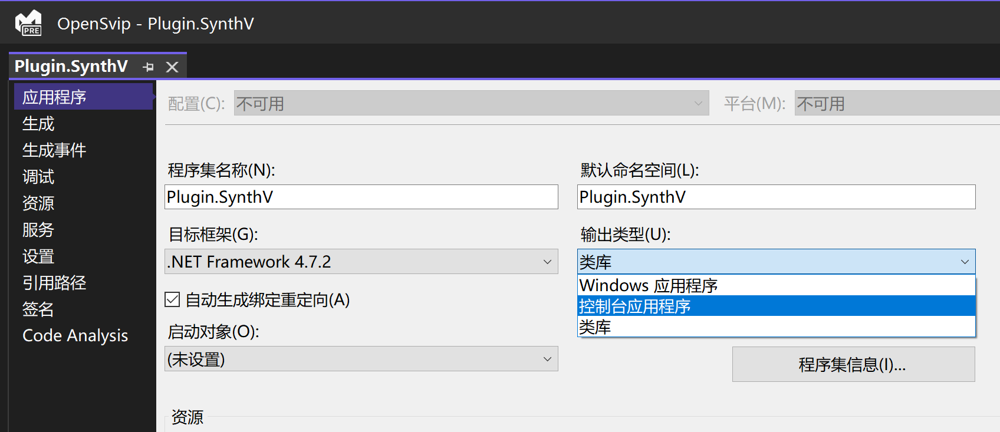

# 开发文档

## 1 项目架构概述

OpenSVIP 是一个基于中介模型的插件式工程格式转换框架。

所有的工程文件经过文件读取或反序列化得到该种格式（源格式）在内存中的数据结构，再将这种数据结构转换和对应到一个统一的数据结构（称为中介模型），这就完成了工程文件的导入步骤。随后，中介模型被转换和对应到另外一种格式（目标格式）的数据结构，再经过文件写入或序列化存储至磁盘上，这就完成了工程文件的导出步骤。

工程文件的导入与导出（包括其中的转换）工作由插件完成。插件存储在特定的目录上，前端程序运行时扫描插件安装目录，并根据配置文件提取出每个插件的信息，得到一个插件列表，并反映在图形界面上供用户选择。转换任务运行时，框架使用反射调用的方式构造转换器的实例并执行对应的接口方法，完成导入与导出工作。因此，框架本身与各个插件是松耦合的状态，框架并不依赖插件运行。

项目结构大致如下：

- `OpenSvip.Model`：中介模型
- `OpenSvip.Framework`：框架主要组件
- `OpenSvip.Library`：框架标准库
- `OpenSvip.Console`：基于命令行运行的开发者工具
- `OpenSvip.GUI`：具有图形界面的桌面应用
- `OpenSvip.Tests`：用于执行单元测试
- `Plugin.*`：各种格式的转换插件

## 2 中介模型

当前版本的中介模型是基于 X Studio 工程文件（SVIP 文件）格式的（原因可以参考 [FAQ 文档](faq.md)中的对应说明），这也是项目名称 OpenSVIP 的来源。X Studio 的工程文件在设计上有许多缺陷，可能会给插件开发造成困扰，因此目前框架提供了一些统一附加接口来进行部分数据的转换。

请您阅读[中介模型描述文档](https://github.com/yqzhishen/opensvip/blob/main/docs/Structure_of_OpenSVIP_Model_and_Framework.md)。若您参与框架或插件的开发，请与开发团队的其余成员保持联系。

中介模型本身也可以被导出为磁盘上的文件（本质上是 JSON 序列化）。请您在[下载中心](..downloads.md)中下载标识符为 `json` 的插件，它可以辅助您完成框架组件或插件的开发和调试。

## 3 框架主要组件

### 3.1 核心转换接口

`IProjectConverter` 是整个转换框架的核心接口。该接口包括两个方法：

- `Load()`：从磁盘中读取源格式的工程文件，并将其转换为 OpenSVIP 中介模型。
- `Save()`：将 OpenSVIP 中介模型转换为目标格式，并将其写入磁盘。

每个插件中均应包括一个该接口的实现类，以供框架进行反射构造实例和调用方法。

### 3.2 转换选项

`ConverterOptions` 类用于存储用户指定的转换选项。每个转换选项都拥有一个独一无二的键（由插件开发者指定）；当用户输入选项后，由插件调用此类提供的方法，将选项值取出并转换为需要的数据类型。

### 3.3 警告信息

`Warnings` 静态类提供数个静态方法处理转换过程中产生的警告信息：

- `AddWarning()`：通常由插件调用。添加一条警告信息。
- `GetWarnings()`：通常由框架调用。取出所有的警告信息。
- `ClearWarnings()`：通常由框架调用。清除所有的警告信息。

### 3.4 插件管理器

`PluginManager` 用于读取、识别和管理插件。此类仅框架调用插件时使用，插件开发者无需关注。

### 3.5 任务沙箱容器

`TaskContainer` 类用于将不同的转换任务隔离在各自的应用程序域（`AppDomain`）中，以方便在转换完成后卸载并释放被占用的 DLL 文件。此类是插件热更新的重要依托。此类仅由 GUI 程序使用，插件开发者无需关注。

## 4 框架标准库

### 4.1 时间轴处理

`TimeSynchronizer` 类用于实现时间轴的重设和转换。其主要功能包括：将任意变速音乐的时间轴重设为单速时间轴并保持对齐；在谱面上的梯和秒两种时间计量单位之间互相转换。具体使用方法请参考代码中的注释。

### 4.2 谱记号处理

`ScoreMarkUtils` 静态类用于处理谱记号列表。谱记号包括拍号和曲速，该类提供数个静态方法以帮助实现谱记号列表的截断。具体使用方法请参考代码中的注释。

### 4.3 歌词拼音转换

`PinyinUtils` 静态类中的 `GetPinyinSeries()` 静态方法用于将汉字序列转换为拼音序列。该方法输入汉字序列，输出对应的拼音序列，在实现词汇级别（而非逐字转换）的转换精确度的同时保持每个元素对齐。具体使用方法请参考代码中的注释。

### 4.4 参数曲线处理

`ParamCurveUtils` 静态类提供参数曲线处理的统一接口。

#### 4.4.1 降低参数点采样率

`ReduceSampleRate()` 扩展方法用于降低参数曲线的采样率，即根据传入的采样间隔对整条参数曲线进行重新采样，合并邻近的参数点并使用平均值替代，从而降低参数点密度。具体使用方法请参考代码中的注释。

#### 4.4.2 切分参数曲线

`SplitIntoSegments()` 扩展方法用于将一条参数曲线根据间断点切分为若干分段。该方法用于将原始中介模型中的参数曲线转换为一种易于遍历的形式。具体使用方法请参考代码中的注释。

### 4.5 范围区间工具类

`Range` 抽象类提供若干范围区间运算的方法。此类包含若干运算符重载和基本的并、交、差、补、扩展、收缩、平移等区间集合运算，可以方便地操作一维整形区间，通常可用于时间轴范围的判定。

`Range` 类包含三个子类，可以在实例化时使用：

- `EmptyRange`：空区间（单例模式）
- `SingleRange`：单段区间
- `CompoundRange`：多段区间

## 5 插件开发流程

本节将以使用 Visual Studio 2022 为例，引导您完成一个插件的开发工作。

### 5.1 新建工程

在项目仓库的 `/csharp/Plugins` 路径下添加一个 `类库(.NET Framework)` 项目，目标框架设置为 `.NET Framework 4.7.2`。假设您需要开发一个用于转换后缀为 `.abc` 的文件格式的插件，则您应将项目名称设置为 `Plugin.Abc`，目录名称设置为 `Abc`。


### 5.2 添加引用

右键“引用”，选择“添加引用”，在“项目-解决方案”选项卡中勾选以下的三个项目（其中标准库组件为非必选）：


### 5.3 创建描述文件

在您的项目的根目录下新建一个名为 `Properties.xml` 的文件，右键该文件，单击“属性”，将该文件设置为“始终复制”或“较新时复制”。


在文件中粘贴以下模板内容：

```xml
<?xml version="1.0" encoding="utf-8"?>
<Plugin>
    <Name>example</Name>
    <Version>0.0.1</Version>
    <Author>example</Author>
    <HomePage>https://example.com</HomePage>
    <UpdateUri>none</UpdateUri>
    <Descriptions>无</Descriptions>
    <!-- (Optional) <TargetFramework>1.3.0</TargetFramework> -->
    <Requirements>无</Requirements>
    <Format>Example 文件</Format>
    <Suffix>example</Suffix>
    <Identifier>example</Identifier>
    <LibraryPath>Example\Plugin.Example.dll</LibraryPath>
    <Converter>Example.Stream.ExampleConverter</Converter>
    <InputOptions/>
    <OutputOptions/>
</Plugin>
```

根据您的设计填写编写该文件。其中，各个子标签的含义如下：

#### `Name`

插件的名称。可以凸显插件的功能或特色，例如“ACE Stdio”包含“ACE Studio”与“标准输入/出”的双重含义。

#### `Version`

插件的三位版本号（X.Y.Z），建议遵循[语义化版本管理](https://semver.org/)原则。此标签用于比较版本新旧与接收更新推送。

#### `Author`

插件作者（您）的称谓。

#### `HomePage`

您的社交平台主页、邮箱地址（以“mailto:”开头）或其他带有您的联系方式的链接。此标签用于向用户提供反馈渠道。

#### `UpdateUri`

插件的更新日志获取地址。此标签用于向用户推送插件更新，默认值为 `https://openvpi.github.io/market/plugin-<id>.toml`（`<id>` 为您插件的标识符）。若您的插件仅计划通过手动下载的方式向用户提供更新，请填入 `none`。

#### `Description`

插件的功能和使用注意事项等描述信息。

#### `TargetFramework`

这是一个可选标签。插件正确运行所需的最低框架版本。当您开始开发插件时，建议您将此标签值设定为当时框架的最新版本。在后续开发中，若框架进行了更新，而您使用了更新版本框架中提供的接口，则您需要随之修改此标签值。通常情况下，框架在新增接口时都会通知您留意此标签的值。

#### `Requirements`

除框架版本外，正常运行此插件需要用户手动满足的条件。例如必须安装某些运行环境或安装特定的软件。通常情况下不需要设置此标签。

#### `Format`

插件所支持转换的格式。此标签的值是用于向用户展示的，例如“X Studio 工程文件”。

#### `Suffix`

插件所支持转换的格式后缀名（不包含“.”号）。此标签值用于向用户展示以及自动识别导入格式。

#### `Identifier`

插件的标识符。这是唯一标识一个插件的字段，插件的更新与检索均依赖于此标签值，因此请不要与其他插件重复。建议设置为后缀名或格式名，例如“svp”或“midi”。

#### `LibraryPath`

包含插件业务逻辑主入口（即 `IProjectConverter` 的实现类）的动态链接库文件路径。路径包含两个部分：您插件的独立文件夹名称与动态链接库（DLL）文件名称。例如 `Example\Plugin.Example.dll`。

#### `Converter`

您插件中 `IProjectConverter` 的实现类的类名。应包含完整的命名空间，例如 `Example.Stream.ExampleConverter`。此类必须位于由 `LibraryPath` 指定的动态链接库中。

#### `InputOptions`

插件对外提供的导入转换选项，即将源格式文件导入并转换为中介模型时的高级选项。这是一个集合类标签，可以包含多个选项。选项元素的模板如下（以布尔类型选项为例）：

```xml
<Option Name="example" Type="boolean" Default="true">
    <Notes>Example</Notes>
    <!-- (Optional) <Tips>Example</Tips> -->
    <!-- (Conditional) <EnumChoices></EnumChoices> -->
</Option>
```

其中各属性与子标签含义如下：

##### `Name`

选项的名称标识符，应保持唯一，即不允许出现两个相同名称的输入（或输出）选项。此属性不会展示给用户。

##### `Type`

选项的数据类型。共允许 5 种数据类型：

- `string`：字符串类型
- `integer`：整数类型
- `double`：双精度浮点数类型
- `boolean`：布尔类型
- `enum`：枚举类型

##### `Default`

此选项的默认值。处于易用性的考量，不允许缺少默认值。不同数据类型的默认值规则如下：

- 字符串：可以是任意文本
- 整数类型：必须是能够被 `int.Parse()` 方法解析的整数
- 双精度浮点数类型：必须是能够被 `double.Parse()` 方法解析的整数
- 布尔类型：必须是 `true` 或 `false`
- 枚举类型：必须是其中一个枚举变量名（忽略大小写）

除此以外，支持使用 `DescriptionAttribute` 指定枚举变量的别名，将代替枚举变量名进行匹配。使用范例如下：

```csharp
public enum Language
{
    [Description("CHN")]
    Chinese,
    [Description("ENG")]
    English,
    Japanese
}
```

此时 "CHN", "chn" 将被解析为 `Language.Chinese`，"ENG", "Eng" 将被解析为 `Language.English`，"Japanese", "japanese" 将被解析为 `Language.Japanese`；"Chinese", "english", "JPN" 等输入将解析失败。

##### `Notes`

用于展示给用户的选项标签，例如“默认歌手名称”。

##### `Tips`

这是一个可选标签。用于向用户提示此选项的效果、用法与注意事项。

##### `EnumChoices`

仅在 Type 属性设置为 `enum` 时有效，代表可用的枚举变量值。这是一个集合类标签，可以包含多个值。枚举值元素的模板如下：

```xml
<Choice Name="Example" Tag="example">
    <!-- (Optional) <Label>Example</Label> -->
</Choice>
```

其中各属性与子标签含义如下：

###### `Name`

向用户展示的枚举值（例如显示在下拉列表框中）。

###### `Tag`

该枚举值的唯一标签，不得与其他枚举值重复。规则同 `Option` 标签的 `Default` 属性。

###### `Label`

这是一个可选标签。用于向用户提示此枚举值的含义或注意事项。

#### `OutputOptions`

插件对外提供的导出转换选项，即将中介模型转换并存储为目标文件格式时的高级选项。设置规则同 `InputOptions` 标签。

### 5.4 编写业务逻辑

您需要创建 `IProjectConverter` 接口的实现类，并实现接口中的两个方法。您的实现类必须拥有一个无参的构造方法（通常可以使用默认构造方法）。示例代码如下：

```csharp
// 省略若干 using
using OpenSvip.Framework;
using OpenSvip.Model;

namespace Example.Stream
{
    public class ExampleConverter : IProjectConverter
    {
        public Project Load(string path, ConverterOptions options)
        {
            // 您的文件导入业务逻辑，包括文件读取与格式转换
            throw new NotImplementedExeption("尚未实现或不支持导入功能");
        }
        
        public void Save(string path, Project project, ConverterOptions options)
        {
            // 您的文件导出业务逻辑，包括格式转换与文件写入
            throw new NotImplementedException("尚未实现或不支持导出功能");
        }
    }
}
```

编写业务逻辑时，请您注意设计代码层次结构，并适当添加注释，以方便自己或其他开发人员进行后续扩展与维护。

### 5.5 测试

#### 5.5.1 在原工程内进行测试

您可以在原工程内添加用于测试的代码，对您的插件进行测试。

右键您的项目，点击“属性”，将“输出类型”改为“控制台应用程序”。



新建 `Test.cs` 文件和其中的 `Test` 类，添加 `Main()` 方法并编写您的测试代码。

```csharp
// 省略若干 using

namespace Example.Tests
{
    public static class Test
    {
        public static void Main()
        {
            // 您的测试逻辑
        }
    }
}
```

建议将输入与输出端分别测试，即分别测试中介模型转到您的格式即您的格式转到中介格式。可以将中介模型通过 JSON 序列化的方式保存到磁盘上。`Newtonsoft.Json` 是框架本身依赖的第三方 JSON 解析库，请使用它进行 JSON 序列化和反序列化。请参考如下代码：

```csharp
public static Project ReadJson(string path)
{
    Project project;
    using (Stream stream = new FileStream(path, FileMode.Open, FileAccess.Read))
    using (Reader reader = new StreamReader(stream, Encoding.UTF8))
    {
        project = JsonConvert.DeserializeObject<Project>(reader.ReadToEnd());
    }
    return project;
}

public static void WriteJson(string path, Project project)
{
    using (Stream stream = new FileStream(path, FileMode.Create, FileAccess.Write))
    using (Writer writer = new StreamWriter(stream, Encoding.UTF8))
    {
        writer.Write(JsonConvert.SerializeObject(project))
    }
}
```

测试逻辑编写完成后即可进行测试。请注意：在正式发布前，请您将项目属性中的“输出类型”改回“类库”。同时，建议设置条件编译以在 Release 模式下忽略测试文件。

右键您的项目，点击“卸载项目”。

再次右键项目，点击“编辑项目文件”。在随后打开的 `.csproj` 文件中找到 `Test.cs` 对应的子标签，添加 `Condition` 属性：


```xml
<Compile Include="Test.cs" Condition=" '$(Configuration)' == 'Debug' " />
```

再次右键项目，点击“重新加载项目”。

正式发布时请切换至 Release 模式进行生成，此时编译器将忽略 `Test.cs` 文件。

#### 5.5.2 使用项目提供的单元测试

[单元测试](https://www.zhihu.com/question/28729261/answer/2009501611)是一种推荐使用的测试方式。您可以在 `OpenSvip.Tests` 项目中引用您自己的插件项目和其他的插件项目，并编写类似框架调用的代码进行测试。同时，您还可以单独对您代码中的关键部分进行测试。

在 `OpenSvip.Tests` 项目中添加您的单元测试文件，例如 `ExampleTests.cs`。编写以下代码：

```csharp
// 省略若干 using
using NUnit.Framework;
using OpenSvip.Framework;
using Example.Stream; // 您的插件的命名空间

namespace OpenSvip.Tests
{
    [TestFixture]
    public class ExampleTests
    {
        [Test]
        public void TestExample01()
        {
            // 您的 01 号测试点
        }
        
        [Test]
        public void TestExample02()
        {
            // 您的 02 号测试点
        }
        
        // ... 其他若干测试点
    }
}
```

在单元测试中，您还可以像框架调用插件那样调用自己编写的插件或其他插件：

```csharp
public static void TestImport(string path)
{
    new ExampleConverter().Load(
        path,
        new ConverterOptions(
            new Dictionary<string, string>()
        )
    );
}

public static void TestExport(string path, Project project)
{
    new ExampleConverter().Save(
        path,
        project,
        new ConverterOptions(
            new Dictionary<string, string>()
        )
    );
}
```

如果要测试您设计的高级选项，可以在实例化 `ConverterOptions` 类时传入，例如：

```csharp
new ConverterOptions(
    new Dictionary<string, string>(
        {"name1", "value1"},
        {"name2", "value2"},
        // ...
    )
)
```

### 5.6 生成和打包

将解决方案配置切换至 Release 和 Any CPU。


右键项目，点击“生成”。等待编译完成后，再次右键项目，点击“在文件资源管理器中打开文件夹”，并进入 `bin/Release/` 目录。

在该目录下新建一个文件夹，这将是您的插件的独立文件夹，命名请参照 `Properties.xml` 中 `LibraryPath` 子标签的配置。

将您的插件所需的文件复制到新建的文件夹内。为了减小插件体积，下列隶属于框架本身的文件无需复制：

- OpenSvip.Model.dll
- OpenSvip.Model.dll.config
- OpenSvip.Framework.dll
- OpenSvip.Library.dll
- Newtonsoft.Json.dll
- Newtonsoft.Json.xml
- ToolGood.Words.Pinyin.dll

除此以外，您也不需要复制后缀名为 `.pdb` 的 Debug 文件。

复制完成后，将该文件夹压缩为 `.zip` 压缩文件格式。建议命名为 `opensvip_plugin_<name>_<version>.zip`，其中 `<name>` 是您的插件名称或标识符，`<version>` 是您插件的三位版本号。

使用转换器菜单栏的“转换>安装插件”功能安装此插件压缩包，如果安装成功、能被正确识别且转换功能不报错，即代表插件打包完成。可以直接发布该压缩包供用户安装。

### 5.7 在线发布与推送更新

OpenSVIP 对外提供统一的插件发布途径，这包括：

- 在本站插件市场发布插件说明文档、更新日志，并在下载中心提供下载链接
- 使用腾讯云对象存储对外提供插件压缩包下载服务

本站的 GitHub 仓库地址为 https://github.com/openvpi/openvpi.github.io。

#### 5.7.1 在插件市场中添加您的插件

在 `/market/` 目录下新建 `plugin-<id>.md`，在其中编写您的插件文档和更新日志。

> 如何编写 Markdown文件？[Markdown 教程](https://www.runoob.com/markdown/md-tutorial.html)

在 `/SUMMARY.md` 文件中添加上一步创建的 Markdown 文件的超链接。

#### 5.7.2 在下载中心中添加您的插件

在 `/downloads.md` 中的插件表格中添加一行，写入您的插件信息和下载链接。

#### 5.7.3 将您的插件压缩包上传至存储桶

请联系项目管理员。如您有自己的下载渠道，可以无视此步骤。

#### 5.7.4 编写版本更新信息

在 `/market/` 目录下新建 `plugin-<id>.toml`，并写入以下模板：

```toml
Version = "0.0.1"
RequiredFrameworkVersion = "1.0.0"
Date = "1926-08-17"
Prologue = ""
Items = [
    
]
Epilogue = ""
DownloadLink = "https://example.com/example.zip"
```

> 如何编写 TOML 文件？[TOML 教程](https://zhuanlan.zhihu.com/p/50412485)

其中各字段含义如下：

##### `Version`

字符串类型。插件的三位版本号。

##### `RequiredFrameworkVersion`

字符串类型。对应 `Properties.xml` 中的 `TargetFramework` 子标签。

##### `Date`

字符串类型。更新发布的日期，yyyy-MM-dd 格式。

##### `Prologue`

字符串类型。显示在开头的文本。可以为空。

##### `Items`

字符串数组类型。通常在此列举更新内容。

##### `Epilogue`

显示在最后的文本。可以为空。

##### `DownloadLink`

此版本插件的下载链接。

#### 5.7.5 正式发布与推送更新

将您的更改推送至本站的 GitHub 仓库，或提交 Pull Request。

您的改动合并至主分支后，将由 GitHub Actions 自动构建并托管至 GitHub Pages。流程结束后，您和用户均可以在本站看到发布与推送的结果。
