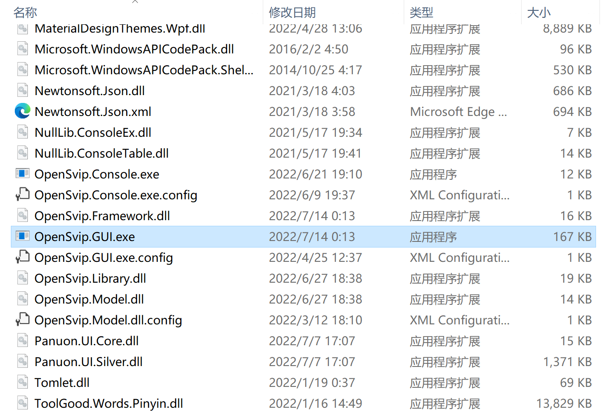
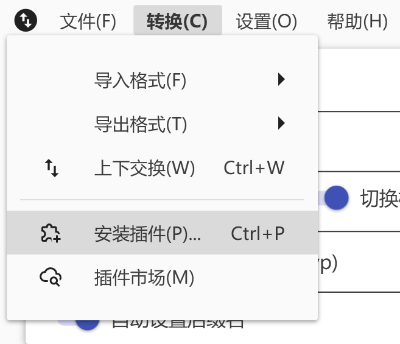
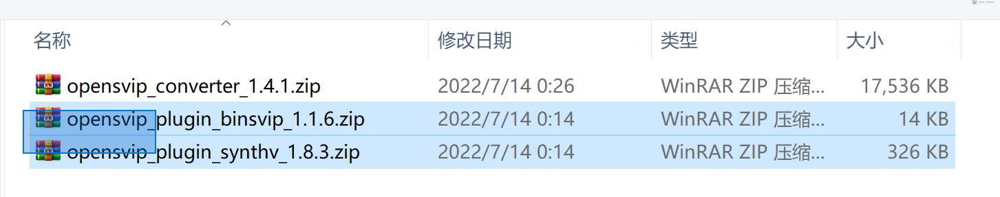

# 用户指南

## 1 快速开始

### 1.1 下载

前往[下载中心](../downloads/summary.md)，下载转换器本体与所需插件。每个插件都对应支持一种文件格式，您只需下载自己需要的插件；例如，若您需要在 X Studio 工程文件 与 Synthesizer V 工程文件 之间互相转换，则需要下载对应的两个插件。

注意：部分插件可能需要您阅读使用条款后才可下载。请跟随对应页面上的指引。

您将得到以下压缩包：

### 1.2 运行

将以 `opensvip_converter` 开头的转换器本体压缩包解压至您认为合适的路径。您将得到一个名为 `OpenSVIP` 的文件夹。进入这个文件夹，双击运行 `OpenSvip.GUI.exe`。

### 1.3 安装插件

在菜单栏上点击“转换>安装插件”。

在弹出的文件浏览对话框中选择以 `opensvip_plugin` 开头的插件压缩包（可以选择多个），并单击“打开”。

随后将依次弹出若干确认与提示对话框，请根据指引操作。

至此，转换器配置完成。后续安装新的插件或升级现有插件时，重复上述步骤即可。转换器本体的更新不会影响已安装的插件。

